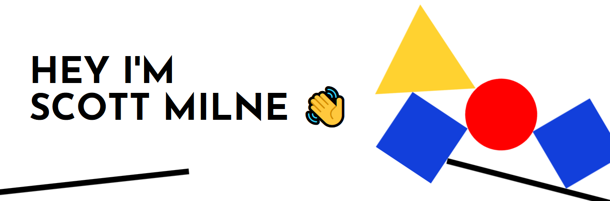

 
  

#

- 🎯 <b>I’m currently focusing on:</b> Finding new job opportunities
- 🌱 <b>I’m currently learning:</b> React
- 🛠️ <b>I’m currently working on:</b> A portfolio website
- 📫 <b>You can contact me by:</b> [Email](mailto:scott.milne6@gmail.com)

 

